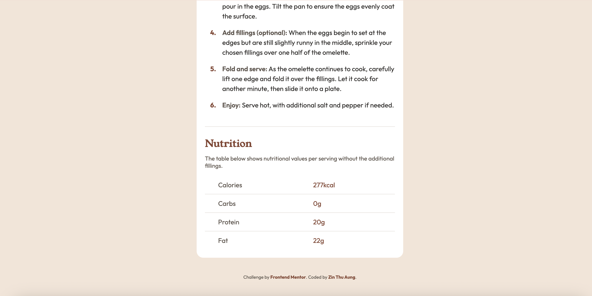
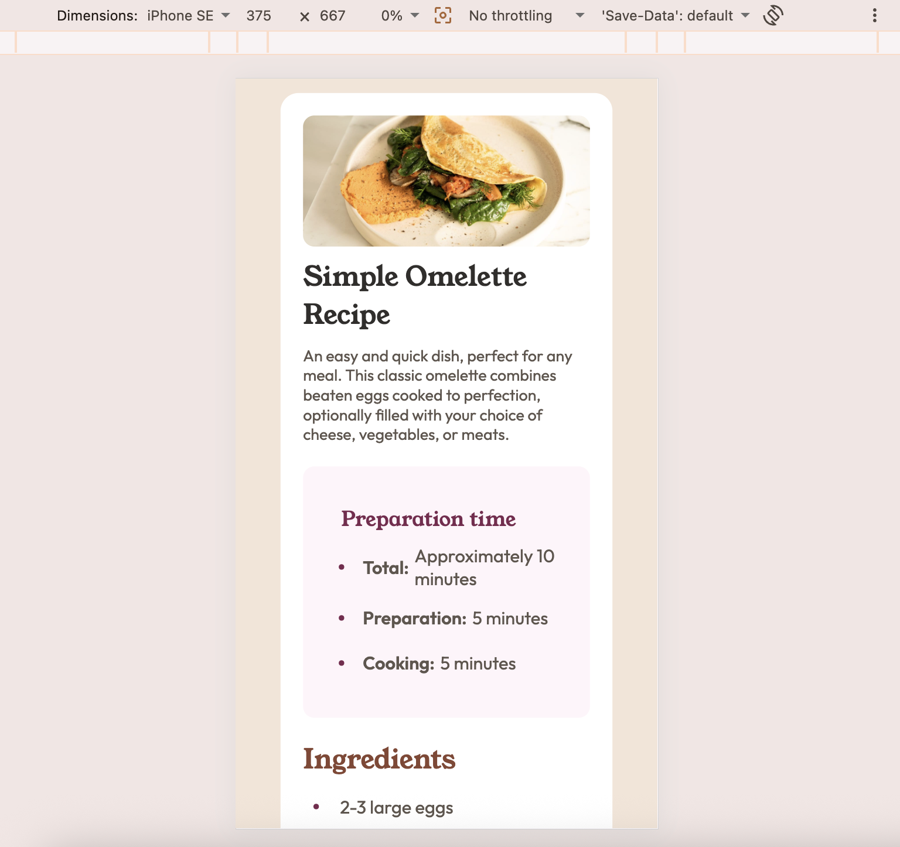
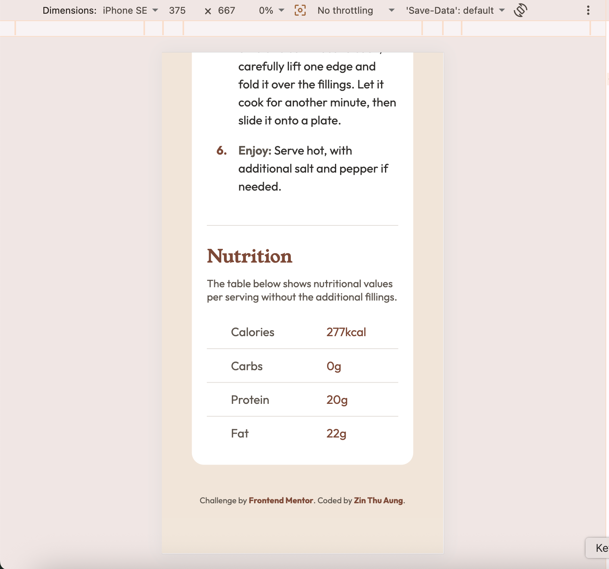

# Frontend Mentor - Recipe page solution

This is a solution to the [Recipe page challenge on Frontend Mentor](https://www.frontendmentor.io/challenges/recipe-page-Ki5UXg6N9M). Frontend Mentor challenges help you improve your real-world coding skills by building realistic projects.

## Table of contents

- [Overview](#overview)
  - [The challenge](#the-challenge)
  - [Screenshot](#screenshot)
  - [Links](#links)
- [My process](#my-process)
  - [Built with](#built-with)
  - [What I learned](#what-i-learned)

## Overview

### The challenge

The challenge was to build out a recipe page and get it looking as close to the design spec as possible using any tools you like. The design needs to be completely responsive across all mobile and desktop viewports.

### Screenshot

*(Tip: Replace this path with a screenshot of your finished project once you push it live!)*

### Links

- Solution URL: 
- Live Site URL: 

### Built with

- Semantic HTML5 markup
- CSS Custom Variables (Design tokens for color palette)
- Flexbox layouts
- CSS Grid & Table components
- Mobile-first responsive workflow

### What I learned

During this project, I mastered custom list styling using pseudo-elements and browser native alignments to maintain perfect structural layouts when text wraps on small screens: